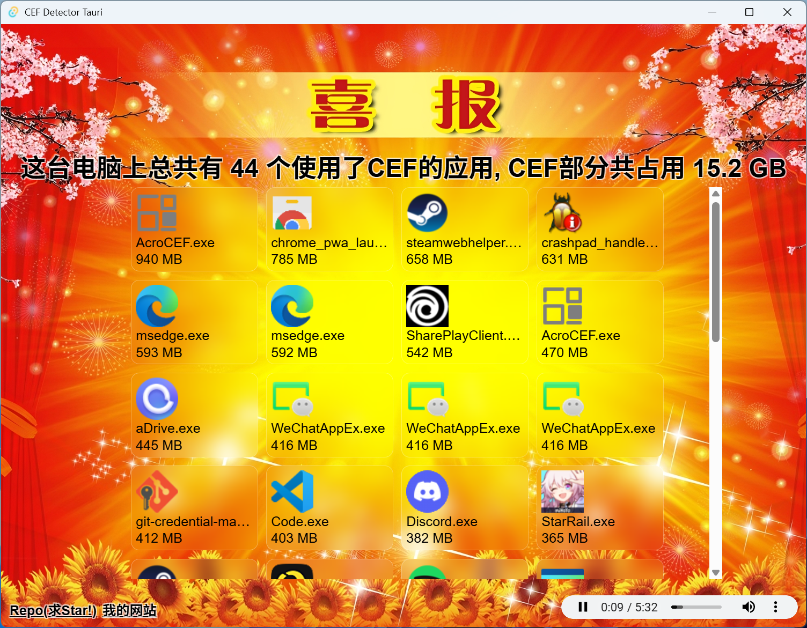

# Cef Detector Tauri - 基于Tauri的CEF检测器 | A Cef Detector based on Tauri

查看你的操作系统里有多少[CEF (Chromium Embedded Framework)](https://github.com/chromiumembedded/cef)。 
Check how many [CEF (Chromium Embedded Framework)](https://github.com/chromiumembedded/cef)s are on your system.

## 本应用基于Rust + Tauri + Vue编写 | This App is written with Rust + Tauri + Vue

### Tauri 是什么？ | What is Tauri?

> Tauri 是一个构建适用于所有主流桌面和移动平台的轻快二进制文件的框架。开发者们可以集成任何用于创建用户界面的可以被编译成 HTML、JavaScript 和 CSS 的前端框架，同时可以在必要时使用 Rust、Swift 和 Kotlin 等语言编写后端逻辑。

> Tauri is a framework for building tiny, fast binaries for all major desktop and mobile platforms. Developers can integrate any frontend framework that compiles to HTML, JavaScript, and CSS for building their user experience while leveraging languages such as Rust, Swift, and Kotlin for backend logic when needed.

### Tauri有哪些优势？| What are the advantages of Tauri?

> - 构建应用所需的可靠基础
> - 使用系统原生 webview（网页视图）带来的更小打包体积
> - 使用任何前端技术和多种语言绑定带来的灵活性

> - Secure foundation for building apps
> - Smaller bundle size by using the system’s native webview
> - Flexibility for developers to use any frontend and bindings for multiple languages

## 用法 | Usage

该应用需要[Microsoft Edge WebView2 Runtime](https://developer.microsoft.com/zh-cn/microsoft-edge/webview2/)才能运行。而且需要用[Everything](https://www.voidtools.com/zh-cn/)完成完整的扫描才能实现功能。

This App requires [Microsoft Edge WebView2 Runtime](https://developer.microsoft.com/en-us/microsoft-edge/webview2/) to run. And it needs to complete a full scan with [Everything](https://www.voidtools.com/) to function.

## 作者 | Author

[u3l6](https://github.com/u3l6)([Website](https://u3l6.github.io/_))

参考项目 | Reference Projects 
[CefDetectorX](https://github.com/ShirasawaSama/CefDetectorX) by [Shirasawa](https://github.com/ShirasawaSama) 
[SafariYYDS](https://github.com/Lakr233/SafariYYDS) by [Lakr233](https://github.com/Lakr233)
